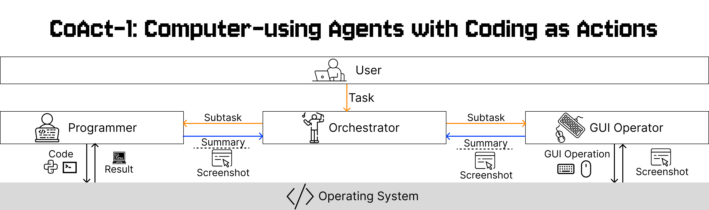

<p align="center">
  
</p>

<p align="center">
  <a href="https://linxins.net/coact">Website</a> •
  <a href="https://arxiv.org/abs/2508.03923">Paper</a>
</p>
Official implementation for the paper "CoAct-1: Computer-using Agents with Coding as Actions"


## 💾 Installation (From OSWorld)
We provide the instruction below of how to apply our method with OSWorld on docker.

### Python environment preparation
Clone this repository and `cd` into it. Then, install the dependencies listed in `requirements.txt`. It is recommended that you use the latest version of Conda to manage the environment, but you can also choose to manually install the dependencies. Please ensure that the version of Python is >= 3.9.

```
# Clone the OSWorld repository
git clone https://github.com/CoAct

# Change directory into the cloned repository
cd CoAct

# Optional: Create a Conda environment for OSWorld
# conda create -n osworld python=3.9
# conda activate osworld

# Install required dependencies
pip install -r requirements.txt
```

### Check if your machine supports KVM
We recommend running the VM with KVM support. To check if your hosting platform supports KVM, run

```bash
egrep -c '(vmx|svm)' /proc/cpuinfo
```
on Linux. If the return value is greater than zero, the processor should be able to support KVM.

> **Note**: macOS hosts generally do not support KVM. You are advised to use VMware if you would like to run OSWorld on macOS.

### Install Docker
If your hosting platform supports a graphical user interface (GUI), you may refer to [Install Docker Desktop on Linux](https://docs.docker.com/desktop/install/linux/) or [Install Docker Desktop on Windows](https://docs.docker.com/desktop/install/windows-install/) based on your OS. Otherwise, you may [Install Docker Engine](https://docs.docker.com/engine/install/).
We provide the docker container implemented with our latest server(`desktop_env/server/main.py`) in [this link](https://drive.google.com/file/d/1dOT4Kb4vceIr3A7d4kQY6wRreY55OQ0B/view?usp=sharing). Please apply it to the "path_to_vm".

### OpenAI key configuration
Fill your OpenAI API key in the `OAI_CONFIG_LIST`, which is for driving the AG2 agents. You can find a template in `./OAI_CONFIG_LIST`. You also need to export your OpenAI API key as your environment variable for driving the `computer-use-preview` model.


## 🧪 Experiments
Run the following script
```bash
python run_coact.py --provider_name docker --path_to_vm /path/to/docker_container --oai_config_path /path/to/OAI_CONFIG_LIST
```
> **Note**: If the experiment is interrupted abnormally (e.g., by interrupting signals), there may be residual docker containers which could affect system performance over time. Please run `docker stop $(docker ps -q) && docker rm $(docker ps -a -q)` to clean up.

The results, which include screenshots, coding and GUI actions, will be saved in the `./results_coact` directory by default. You can then run the following command to obtain the result:
```bash
python show_result.py
```

### Evaluation
Please start by reading through the [agent interface](https://github.com/xlang-ai/OSWorld/blob/main/mm_agents/README.md) and the [environment interface](https://github.com/xlang-ai/OSWorld/blob/main/desktop_env/README.md).
Correctly implement the agent interface and import your customized version in the `run.py` file.
Afterward, you can execute a command similar to the one in the previous section to run the benchmark on your agent.

## ❓ FAQ
### What is the username and password for the virtual machines?
The username and password for the virtual machines are as follows:
- **Ubuntu:** `user` / `password`

### How to update the RESTFul server in docker container?
If you modify the `desktop_env/server/main.py` for applying some new features, you need to update them to the docker container to activate those changes by the following steps (in case you are using Linux):
1. Log into `su` by `sudo su`
2. mount the docker container disk to the `/mnt/vm` (it can be other place) in your local machine by the following command
    - [First time only] `sudo apt install libguestfs-tools`
    - `guestmount -a /path/to/Ubuntu.qcow2 -i /mnt/vm`
3. Replace the flask server entry (main.py) in `/mnt/vm/home/user/server/main.py` to the new version by `cp /path/to/desktop_env/server/main.py /mnt/vm/home/user/server/main.py`
4. Unmount the disk
    - `guestunmount /mnt/vm`


## 📄 Citation
If you find this environment useful, please consider citing our work:
```
@misc{song2025coact1computerusingagentscoding,
      title={CoAct-1: Computer-using Agents with Coding as Actions}, 
      author={Linxin Song and Yutong Dai and Viraj Prabhu and Jieyu Zhang and Taiwei Shi and Li Li and Junnan Li and Silvio Savarese and Zeyuan Chen and Jieyu Zhao and Ran Xu and Caiming Xiong},
      year={2025},
      eprint={2508.03923},
      archivePrefix={arXiv},
      primaryClass={cs.CL},
      url={https://arxiv.org/abs/2508.03923}, 
}
```

## Disclaimer

This release is for research only purposes. See the [license](LICENSE.txt) for more details. This release should not be used to develop models that compete with OpenAI.